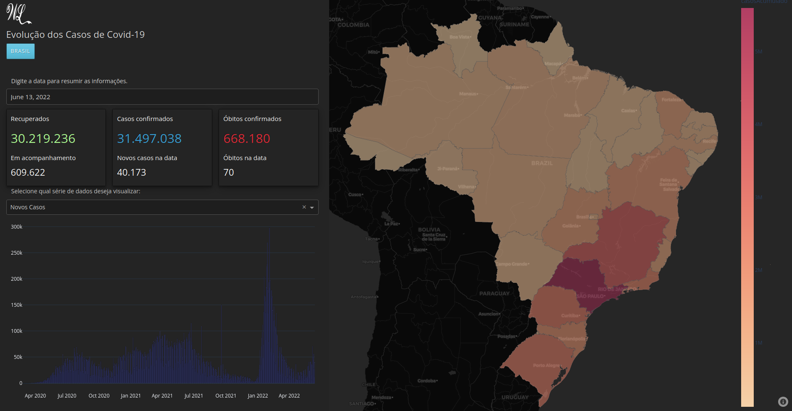

# Dashboards Projects

## 

## Content

- [Dashboards Projects](#dashboards-projects)
  - [Content](#content)
  - [Covid19 Dashboard](#covid19-dashboard)
  - [Dashboard de Vendas](#dashboard-de-vendas)
 

Repositório destinado ao armazenamento de projetos para o desenvolvimento de **Dashboards** principalmente com a linguagem python. Estes projetos foram criados principalmente com a biblioteca **Dash** e **Plotly**. Aqui são armazenados dashboards das mais variadas áreas de estudo. 

##

## Covid19 Dashboard

Para o desenvolvimento do Dashboard sobre a distribuição de casos da **Covid19** foram utilizados dados disponíveis no site do [Ministério da Saúde](https://covid.saude.gov.br).

Após o tratamento da base de dados, foi construido o dashboard da distribuição de casos novos, casos acumulados, obitos novos e obitos acumulados por estados brasileiros e ao nível do Brasil. A aparência do dashboard é dada abaixo: 

##

## Dashboard de Vendas
